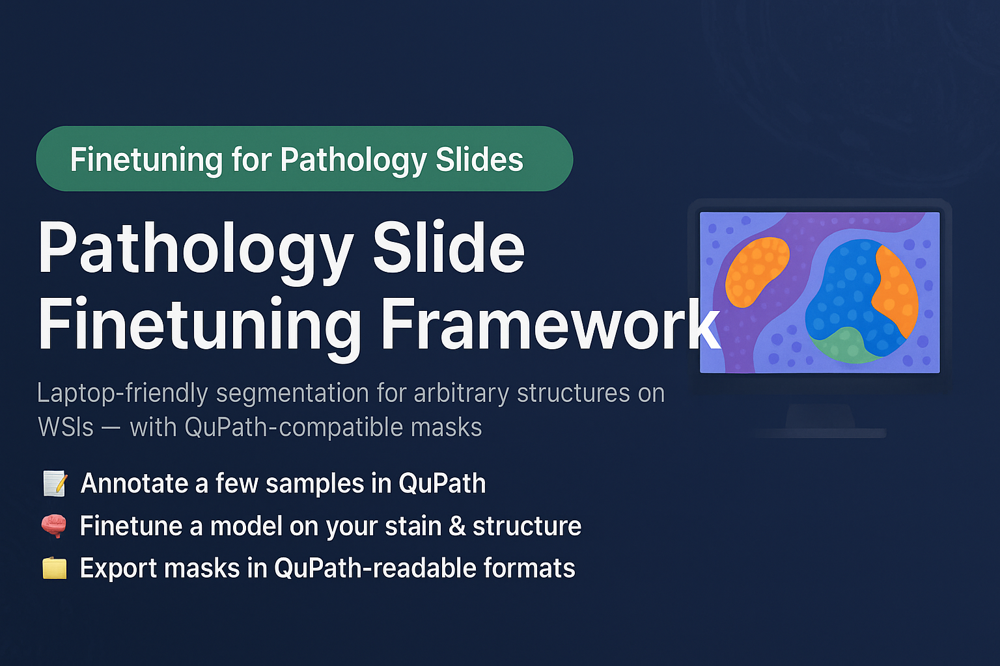

# Segment Really Anything - Even Your Whole Slide Images on a Laptop

<!-- Project Banner -->
<p align="center">
  
</p>

<h1 align="center">Pathology Slide Finetuning Framework</h1>

<p align="center">
  🧬 Laptop-friendly finetuning of segmentation models for arbitrary structures on WSIs  
</p>

---

## 👋 Introduction

So—you want to **segment some arbitrary structure on pathology slides**.  
Sounds simple, right? After all, *AI is everywhere!* 🤖✨

But once you start searching for tools, reality hits fast:

- 💸 Many solutions require **expensive commercial platforms**
- 🧠 Others feel like you need a **PhD in computer vision** just to run them
- 🧪 Most pretrained models were trained on **different stainings**, making them useless for your specific task

If you’ve ever thought:

> “I’m too lazy or simply not capable of getting these existing methods to work…”

…then this project is **exactly for you**.  
You’re not alone—and it really shouldn’t be this hard.

---

## 🎯 What This Project Gives You

This framework provides a **simple, practical, laptop-friendly** pipeline that lets you finetune a segmentation model for **your structures** on **your slides**:

### 🔧 The Workflow

1. 📝 **Annotate a few examples** of the target structure  
   Use **QuPath** to draw annotations on a small set of slides.

2. 🧠 **Finetune a segmentation model**  
   Train a model specifically on your annotations and your staining.

3. 🗂 **Generate & export segmentation masks**  
   Run inference on the rest of your slides and export masks in a **QuPath-readable format**.

That’s it. No GPU clusters, no server processes, no 200-line configs you don’t understand.

---

## 📌 Why Not Just Use Existing Tools?

Most existing solutions for finetuning pathology models are either **too heavy**, **too outdated**, or **don’t play nicely** with real-world pathology workflows.

### Limitations of Existing Solutions

| Method / Ecosystem | Strengths | Major Limitations (Motivation for This Project) |
|--------------------|-----------|--------------------------------------------------|
| **MONAI Label Server** | Good integration with MONAI pipelines; semi-automatic labeling | Requires dedicated **GPU server**, difficult to run on laptops; complex setup; produces **cryptic runtime errors**; not optimized for WSI-scale finetuning |
| **Napari Pathology Plugins** | Plugin-based architecture; simple UI | Many plugins are **outdated**, unstable, or unmaintained; poor handling of large WSIs; limited or no finetuning support; segmentation tools often unreliable |
| **MedSAM / SAM Finetuning** | Strong pretrained segmentation capabilities | Finetuning typically produces only **binary/semantic segmentation masks**; output masks **cannot be viewed or edited directly in QuPath**; workflows are often non-transparent and hard to adapt |
| **Generic PyTorch/TensorFlow Scripts** | Full flexibility; research-friendly | Not optimized for WSIs; require extensive coding; missing built-in **patch extraction, slide metadata handling, QuPath mask support**, or pathology-specific evaluation tools |
| **Commercial Annotation Tools** | Polished UI, enterprise support | Limited customizability; expensive; finetuning often not transparent; export formats frequently **incompatible with open-source pathology tools** |

---

## ✨ Project Goals

- ✅ **Accessible** – runs on a laptop (CPU, optional GPU)
- ✅ **Transparent** – no black-box servers or mysterious Docker stacks
- ✅ **Pathology-first** – built for WSIs, not toy image datasets
- ✅ **QuPath-friendly** – annotations in, masks out, no hacks
- ✅ **Extensible** – plug in your own models and backbones

---

## 🚀 Quick Start (Sketch)

```bash
# 1. Clone the repo
git clone <YOUR-REPO-URL>.git
cd <YOUR-REPO-NAME>
pip install -e .


# 3. Run a minimal finetuning example
python train.py --config configs/finetune_example.yaml
```
## ✏️ Provide GT segmentations
1. Annotate as much slides as you want (of course the amount of annotated slides impacts the performance)
2. Load your images to QuPath 

3. For fast annotations, we recommedn using the magic brush from the tools bar in QuPath
4. Select > File > Export objects as geojson > Export All objects 


5. Name your slide and geojson slide_1.svs + slide_1